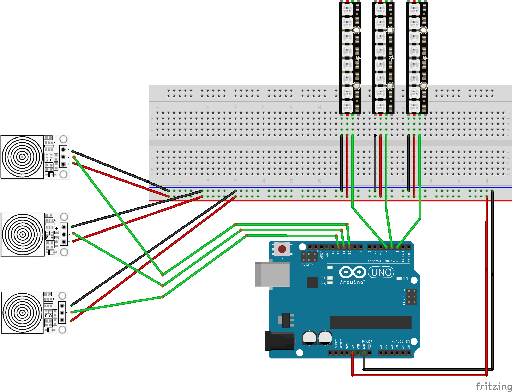

# Drum Hero Arduino
Ce projet est un jeu de rythme développé lors d'un cours à option de troisième année de Bachelor en Ingénierie des Médias à la HEIG-VD.

Ayant un attrait particulier pour les jeux vidéo / d'arcade, notamment les jeux de rythme, j'ai trouvé l'idée de créer mon propre jeu intéressante et motivante.

## Principe du jeu

Des steps descendent le long de trois bandes de LEDs.

Le joueur doit toucher le capteur correspondant au moment où le step atteint le bas de la bande.

Si le timing est correct, le step est validé et le score augmente.
Sinon, le step est considéré comme un miss et le combo est réinitialisé.

## Mes inspirations

- **Guitar Hero (Activision)**  
https://fr.wikipedia.org/wiki/Guitar_Hero_(s%C3%A9rie_de_jeux_vid%C3%A9o)  
Inspiration particulièrement pour le système de bandes d'affichage verticales des steps et les lignes de couleurs.

- **Donkey Konga (Nintendo)**  
https://fr.wikipedia.org/wiki/Donkey_Konga  
Inspiration pour les contrôleurs en forme de bongos.

- **Dance Dance Revolution (Konami)**  
https://fr.wikipedia.org/wiki/Dance_Dance_Revolution  
Inspiration pour l'esthétique lumineuse et le principe du jeu de rythme.

- **Taiko no Tatsujin (Namco)**  
https://fr.wikipedia.org/wiki/Taiko_no_Tatsujin  
Inspiration pour la forme de l'objet, proche d'une borne d'arcade.

---

# Vidéos

À ajouter.

---

# Matériel

## Schéma

## Liste des composants 

- 1 × Arduino Uno
- 3 × bandes de LEDs NeoPixel (72 LEDs)
- 3 × capteurs tactiles capacitifs (WHADDA WPSE305)
- câbles de connexion
- alimentation USB

## Architecture du système

Le système est composé de 4 parties principales :

### Entrées
- 3 capteurs tactiles capacitifs
- Détection de touches avec debounce et cooldown

### Logique de jeu
Le moteur du jeu gère :
- la génération des steps
- la détection des hits et des misses
- le score et le combo
- la progression temporelle du jeu

### Sorties
- 3 bandes de LEDs NeoPixel pour afficher les steps
- sortie série pour le debug et l'interface web

### Interface web
- communication avec l'Arduino via WebSocket
- client réalisé avec p5.js
- affichage de l'état du jeu
- génération du son du jeu

---
## Structure du code

Le projet est organisé en plusieurs modules :

- **main.ino**  
  Boucle principale du jeu et gestion des états.

- **game.h**  
  Logique du jeu : gestion des steps, score, hits et misses.

- **leds.h**  
  Gestion de l'affichage des steps sur les bandes de LEDs.

- **touchsensor.h**  
  Gestion des capteurs tactiles avec debounce et cooldown.

- **/web_client**
  Interface Web et gestion du son du jeu.

---

# Comment reproduire le projet
## Librairies nécessaires

- Adafruit NeoPixel
- Chrono

## Étapes

1. Reproduire le schéma avec le matériel présenté ou l'adapter à votre matériel.
2. Adapter les **pins** dans le code selon votre montage.
3. Adapter la constante `NUMPIXELS` (72) dans le fichier `leds.h` selon la longueur de vos strips.
4. Télécharger les librairies nécessaires.
5. Connecter la carte Arduino à un ordinateur et **uploader le sketch** du repository.

### Interface web (optionnel)

5. Télécharger **P5.js** : https://p5js.org/download/
6. Ouvrir le client P5 et sélectionner votre carte Arduino.
7. Lancer le dossier `web_client` avec un serveur web.
8. Ouvrir un navigateur sur le port du serveur.

Have fun !

---

# Configurer votre jeu

Plusieurs variables permettent d'ajuster la difficulté du jeu.

### Tolérance
Seuil de tolérance pour valider un step.  
Modifiable dans `game.h`.

### Vitesse d'affichage
Vitesse à laquelle un step descend le long des LEDs.  
Modifiable dans `leds.h`.

### Intervalle entre les steps
Actuellement fixé à **400 ms** dans `game.h`.

---

# Limitations

Dans cette version, les LEDs ne sont **pas alimentées par une source externe**.

Cela limite le matériel nécessaire mais aussi la puissance disponible.  
C'est pourquoi la luminosité est réglée à **30**, modifiable dans `leds.h`.

De plus, le jeu effectue de nombreuses boucles de vérification et d'affichage.  
Cela limite le nombre de steps possibles dans une partie. Le nombre de steps se définit à l'initialisation de Game, dans le fichier principal .ino.
Augmenter fortement ce nombre peut ralentir ou faire planter le jeu.

Des optimisations seraient nécessaires pour améliorer les performances.

--- 

# Pistes d'améliorations

Le jeu pourrait gagner en intérêt si les steps étaient vraiment raccordé à une musique, c'est-à-dire que les steps sont timé pour jouer une réelle mélodie, avec des sons de la bonne durée et des écarts entre les notes corrects. 
De plus, avec une alimentation externe, il serait intéressant de faire des animations sur les leds plus importantes, pour donner des feedbacks utilisateurs. 
Finalement, il serait intéressant de donner à l'utilisateur la possibilité d'adapter la difficulté du jeu via le client web. 
